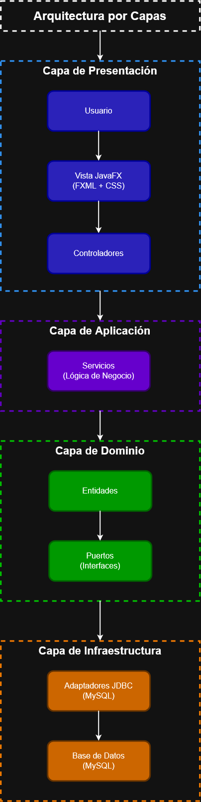
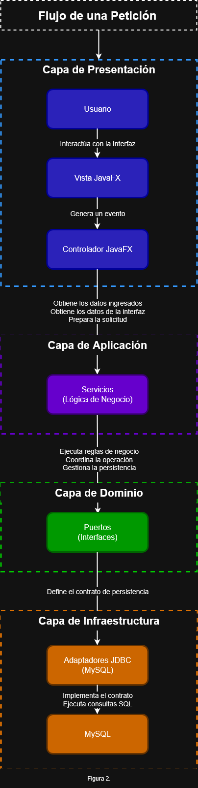

# Retail Management System

---

# 🇺🇸 English

# Retail Management System

## Description

It is a desktop application designed to manage the operation of a retail store and the sales process for products and services. It allows for the management of global configurations, products, services, multiple inventories, taxes, discounts, and other elements fundamental to business operations. It is geared towards managing a single store and was designed considering the main business and regulatory requirements present in sales processes.

The project aims to offer a centralized point-of-sale and management system with a strong emphasis on domain modeling and business rules. The store domain was chosen for the diversity of scenarios it allows to be represented, such as inventory management, tax and discount calculation, handling different types of products, and invoice generation, prioritizing a design that reflects the real-world behavior of the business.

This project began as a console application with the goal of learning object-oriented programming and gradually evolved into a complete desktop application. Throughout its development, persistence using JDBC and MySQL, a layered architecture, and a graphical interface with JavaFX were incorporated. The entire project was developed without using frameworks in order to understand in depth the fundamentals of Java, software design and persistence before working with technologies such as Spring Boot.


## 🚧 Project status

**Current Version:** Pre-release

| Module           | Status            |
|------------------|-------------------|
| Store Management | ✅ Completed       |
| Point of Sale    | 🚧 In Development |
| Documentation    | 🚧 In Development |
| Version 1.0      | ⏳ Pending         |

### Next Goal

Release version **1.0.0**, which will include the fully completed management module along with the point of sale system.


## Features

### 🏪 Store Management
- Global store configuration.
- Management of general business information.

### 📦 Product Management
- Registration, viewing, updating, and deletion of products.
- Support for multiple product types with specific behaviors.
- Association of specific features based on product type.
- Monitoring of product availability status.

### 🛠️ Service Management
- Independent management of services.
- Treatment of products and services as billable items within the sales process.
- Monitoring of service availability status.

### 📚 Inventory Management
- Management of multiple inventories.
- Association of any product type with an inventory.
- Stock control per inventory.

### 💰 Sales Management
- Management of taxes and discounts.
- Price management using BigDecimal to ensure accuracy in monetary calculations.
- Expiration policy configuration.
- Activation and deactivation of business configurations.

### 🧾 Billing
- Invoice generation.
- Recording of complete sales details.
- Automatic application of taxes and discounts.
- Accurate calculation of subtotals and totals.

### 🖥️ Point of Sale
- Sales process via a graphical interface.
- Selection of products and services.
- Automatic invoice generation.
- **Status:** 🚧 Under development.

### 🎨 User Interface
- Desktop application developed with JavaFX.
- Interface based on FXML and CSS.


## Design Decisions

### Product Specialization

Products are not modeled as a generic entity. Each product type has its own attributes and business rules that can modify its behavior both during management and in the sales process. To maintain a flexible and scalable model, information common to all products is separated from the specific characteristics of each category. Currently, the system implements products such as Clothing and Perishables, and its design allows for the incorporation of new product types without modifying the existing structure, such as future technological products.

This decision avoids concentrating all characteristics and behaviors in a single generic entity, facilitating the scalability of the model and allowing the incorporation of new types of products without affecting existing ones.

### Distinction between Products and Services

Products and services are modeled as independent entities due to differences in their behavior within the domain. While a product is part of inventory and is subject to stock control, a service does not require stock or inventory management. Despite these differences, both participate in the sales process as billable items, allowing the same invoice to include products and services through a unified billing flow. This separation keeps the domain model consistent without duplicating sales process logic.

This decision avoids treating services as a special type of product and allows each entity to implement only the business rules that correspond to it.

### Use of BigDecimal

All operations involving monetary values and percentages were implemented using Java's BigDecimal class. This decision ensures accurate calculations in operations such as applying taxes and discounts, as well as obtaining subtotals, totals, and final prices, avoiding the precision errors associated with floating-point data types.

This decision guarantees the accuracy of monetary calculations and reflects a widely used practice in business applications where the accuracy of values is a fundamental requirement.

### Layered Architecture

From the early stages of the project, a layered architecture was adopted to clearly separate the responsibilities of each system component. The user interface, business logic, and persistence are developed independently, allowing each layer to focus solely on its function. This facilitates code maintenance, improves readability, and allows for the incorporation of changes or new functionalities without unnecessarily affecting the rest of the application.

This decision reduces coupling between components and promotes a more maintainable, scalable, and easily evolving system.

### Inter-Layer Communication

Communication between the user interface and the domain is handled through DTOs and assemblers, preventing the presentation layer from directly accessing business entities. Similarly, access to persistence is abstracted through interfaces and dependency injection, allowing the business logic to be decoupled from its implementation. This approach facilitates the replacement or evolution of individual components without affecting the operation of the rest of the system and maintains a clear separation between the different responsibilities of the application.

This decision avoids unnecessary dependencies between layers and promotes a more flexible, decoupled, and easy-to-maintain design.

### Persistence Using Pure JDBC

The persistence layer was developed using pure JDBC instead of frameworks or ORMs. This decision was made to gain a deep understanding of how data access, connection management, SQL query execution, and the mapping between the domain model and the database work. The project implements its own persistence layer, keeping the data access logic completely separate from the domain and business logic.

This decision allowed for building a solid foundation in Java persistence fundamentals before incorporating higher-level tools like Spring Data or Hibernate.

### Persistence Decoupling

The domain defines data access contracts through interfaces, while their concrete implementations reside in the infrastructure layer. In this way, the business logic depends solely on abstractions and not on specific persistence technologies. This organization allows for replacing the data access implementation without modifying the domain or the application services.

This decision reduces the coupling with persistence technology and facilitates system evolution and maintenance.

### Multiple Inventories

The system allows the management of multiple inventories within the same store, treating each inventory as an independent unit for stock control. Products are managed through their corresponding inventory, maintaining a clear separation between product information and its storage location. This allows for the representation of different storage spaces while maintaining independence between them and precise control over the products recorded in each inventory.

This decision keeps the product model decoupled from inventory control and facilitates consistent stock management.

### Historical Preservation Through Logical Deletion

Entities involved in business processes, such as products, services, taxes, discounts, and expiration policies, cannot be deleted from the application. Instead, the system allows their availability to be activated or deactivated, preventing them from falling into disuse without losing the associated historical information.

This decision ensures that historical records, such as invoices, retain all their original references even when some of these elements are no longer used in daily operations. This allows for accurate retrieval of past sales without compromising data integrity. The user interface allows for managing the status of these entities through activation and deactivation options, enabling them to be hidden from daily operations without deleting them from the database.

This decision preserves the integrity of the business history, prevents inconsistencies in historical records, and allows for the removal of operational elements without affecting previously recorded information.

### Database Integrity

The database was designed prioritizing data integrity and consistency through a relational model that reflects the relationships between entities in the domain. Integrity constraints, foreign keys, and validation rules are used to ensure the consistency of the stored data.

The system avoids unnecessary data duplication through relationships between entities, ensuring that products, taxes, discounts, and expiration policies maintain consistent references within the data model. Furthermore, most required attributes are stored as non-null values, reducing the possibility of recording incomplete or inconsistent information.

This decision strengthens data reliability and allows business rules to be based on a consistent and secure data model.

### Independent Configuration Catalogs

Taxes, discounts, and expiration policies are modeled as product-independent entities and managed through their own catalogs. Instead of storing these values ​​directly in each product, the system maintains references to the corresponding configurations. This approach allows for centralized modification or expansion of these elements, facilitating system adaptation to changes in business or regulatory conditions without altering the product model. It also promotes the reuse of common configurations across multiple products and avoids data duplication.

This decision centralizes the management of configurable business rules, improves data consistency, and facilitates system evolution in response to future changes.


## Technologies Used

| Technology   | Use                                     |
|--------------|-----------------------------------------|
| Java         | Business Logic                          |
| JavaFX       | Desktop Graphical Interface             |
| FXML         | Definition of Interface Views           |
| CSS          | Graphical Interface Styles              |
| JDBC         | Data Persistence                        |
| HikariCP     | JDBC Connection Pool                    |
| MySQL        | Relational Database                     |
| Maven        | Dependency Management and Project Build |


## Installation and Execution

### Requirements

- Java 26 or higher
- Maven
- MySQL
- Git

### 1. Clone the repository

Download a local copy of the project by running:

```bash
git clone https://github.com/carrascalpjosedanieldev/retail-management-system.git 
cd retail-management-system
```

### 2. Configure the database

A copy of the project's database is included in the database/ folder.

Import the SQL file into MySQL. The script will automatically create the "mi_tienda" database if it doesn't already exist.

### 3. Configure the connection

Rename the file:

text
application.properties.example

to

text
application.properties

and configure the following information:

- Database URL (By default, it's the name of the database created by the script)
- Username
- Password

For your convenience, the instructions are also included in text application.properties.example

### 4. Run the project

Open the project with your preferred Maven-compatible IDE (IntelliJ IDEA), wait for Maven to download the dependencies, and run the application's main class.


---

---

# 🇪🇦 🇨🇴 Español

# Sistema de gestión para tiendas minoristas

## Descripción

Es una aplicación de escritorio diseñada para gestionar la operación de una tienda minorista y el proceso de venta de productos y servicios. Permite administrar configuraciones globales, productos, servicios, múltiples inventarios, impuestos, descuentos y otros elementos fundamentales para la operación del negocio. Orientado a la gestión de una única tienda y fue diseñado considerando los principales requisitos de negocio y normativos presentes en los procesos de venta.

El proyecto busca ofrecer un sistema de gestión y punto de venta centralizado con un fuerte énfasis en el modelado del dominio y las reglas de negocio. El dominio de una tienda fue elegido por la diversidad de escenarios que permite representar, como la gestión de inventarios, el cálculo de impuestos y descuentos, el manejo de distintos tipos de productos y la generación de facturas, priorizando un diseño que refleje el comportamiento real del negocio.

Este proyecto comenzó como una aplicación de consola con el objetivo de aprender programación orientada a objetos y evolucionó gradualmente hasta convertirse en una aplicación de escritorio completa. A lo largo de su desarrollo se incorporaron persistencia mediante JDBC y MySQL, una arquitectura por capas y una interfaz gráfica con JavaFX. Todo el proyecto fue desarrollado sin utilizar frameworks con el propósito de comprender en profundidad los fundamentos de Java, el diseño de software y la persistencia antes de trabajar con tecnologías como Spring Boot.


## 🚧 Estado del proyecto

**Versión actual:** Pre-lanzamiento

| Módulo               | Estado           |
|----------------------|------------------|
| Gestión de la tienda | ✅ Finalizado     |
| Punto de venta       | 🚧 En desarrollo |
| Documentación        | 🚧 En desarrollo |
| Versión 1.0          | ⏳ Pendiente      |

### Proximo Objetivo

Publicar la version **1.0.0**, que incluirá el módulo de gestion completamente terminado junto con el punto de venta.


## Características

### 🏪 Gestión de la tienda
- Configuración global de la tienda.
- Administración de información general del negocio.

### 📦 Gestión de productos
- Registro, consulta, actualización y eliminación de productos.
- Soporte para múltiples tipos de productos con comportamientos específicos.
- Asociación de características propias según el tipo de producto.
- Control del estado de disponibilidad de los productos.

### 🛠️ Gestión de servicios
- Administración independiente de servicios.
- Tratamiento de productos y servicios como ítems facturables dentro del proceso de venta.
- Control del estado de disponibilidad de los servicios.

### 📚 Gestión de inventarios
- Administración de múltiples inventarios.
- Asociación de cualquier tipo de producto a un inventario.
- Control del stock por inventario.

### 💰 Gestión comercial
- Administración de impuestos y descuentos.
- Gestión de precios utilizando BigDecimal para garantizar precisión en cálculos monetarios.
- Configuración de políticas de vencimiento.
- Activación e inactivación de configuraciones comerciales.

### 🧾 Facturación
- Generación de facturas.
- Registro del detalle completo de la venta.
- Aplicación automática de impuestos y descuentos.
- Cálculo preciso de subtotales y totales.

### 🖥️ Punto de venta
- Proceso de venta desde una interfaz gráfica.
- Selección de productos y servicios.
- Generación automática de la factura.
- **Estado:** 🚧 En desarrollo.

### 🎨 Interfaz de usuario
- Aplicación de escritorio desarrollada con JavaFX.
- Interfaz basada en FXML y CSS.


## Decisiones de Diseño

Las siguientes decisiones de diseño reflejan los principios que guiaron el desarrollo del proyecto. En cada caso se buscó construir un modelo de dominio coherente con el funcionamiento de una tienda minorista, priorizando la claridad del diseño, la mantenibilidad del código y la integridad de la información antes que la rapidez de implementación.

### Especialización de Productos

Los productos no se modelan como una entidad genérica. Cada tipo de producto posee atributos y reglas de negocio propias que pueden modificar su comportamiento tanto durante la gestión como en el proceso de venta. Para mantener un modelo flexible y escalable, la información común de todos los productos se separa de las características específicas de cada categoría. Actualmente el sistema implementa productos como Ropa y Perecederos, y su diseño permite incorporar nuevos tipos de productos sin modificar la estructura existente, como futuros productos tecnológicos.

Esta decisión evita concentrar todas las características y comportamientos en una única entidad genérica, facilitando la escalabilidad del modelo y permitiendo incorporar nuevos tipos de productos sin afectar los ya existentes.

### Separación entre Productos y Servicios

Los productos y los servicios se modelan como entidades independientes debido a las diferencias en su comportamiento dentro del dominio. Mientras que un producto forma parte de un inventario y está sujeto al control de stock, un servicio no requiere existencias ni gestión de inventario. A pesar de estas diferencias, ambos participan en el proceso de venta como ítems facturables, permitiendo que una misma factura incluya productos y servicios mediante un flujo de facturación unificado. Esta separación mantiene el modelo de dominio coherente sin duplicar la lógica del proceso de venta.

Esta decision evita tratar los servicios como un tipo especial de producto y permite que cada entidad implemente únicamente las reglas de negocio que le corresponden.

### Uso de BigDecimal

Todas las operaciones relacionadas con valores monetarios y porcentajes se implementaron utilizando la clase BigDecimal de Java. Esta decisión garantiza cálculos precisos en operaciones como la aplicación de impuestos y descuentos, así como en la obtención de subtotales, totales y precios finales, evitando los errores de precisión asociados a los tipos de dato de punto flotante.

Esta decisión garantiza la precisión de los cálculos monetarios y refleja una práctica ampliamente utilizada en aplicaciones empresariales donde la exactitud de los valores es un requisito fundamental.

### Arquitectura por capas

Desde las primeras etapas del proyecto se adoptó una arquitectura por capas con el objetivo de separar claramente las responsabilidades de cada componente del sistema. La interfaz de usuario, la lógica de negocio y la persistencia se desarrollan de forma independiente, permitiendo que cada capa se centre únicamente en su función. Facilitando el mantenimiento del código, mejorando su legibilidad y permitiendo incorporar cambios o nuevas funcionalidades sin afectar innecesariamente al resto de la aplicación.

Esta decisión reduce el acoplamiento entre los componentes y favorece un sistema más mantenible, escalable y fácil de evolucionar.

### Comunicación entre capas

La comunicación entre la interfaz de usuario y el dominio se realiza mediante DTO y ensambladores, evitando que la capa de presentación acceda directamente a las entidades del negocio. De igual forma, el acceso a la persistencia se abstrae mediante interfaces e inyección de dependencias, permitiendo desacoplar la lógica de negocio de su implementación. Este enfoque facilita la sustitución o evolución de componentes individuales sin afectar el funcionamiento del resto del sistema y mantiene una clara separación entre las distintas responsabilidades de la aplicación.

Esta decisión evita dependencias innecesarias entre las capas y favorece un diseño más flexible, desacoplado y fácil de mantener.

### Persistencia mediante JDBC puro

La capa de persistencia fue desarrollada utilizando JDBC puro en lugar de frameworks u ORM. Esta decisión fue tomada con el objetivo de comprender en profundidad el funcionamiento del acceso a datos, la gestión de conexiones, la ejecución de consultas SQL y el mapeo entre el modelo de dominio y la base de datos. El proyecto implementa una capa de persistencia propia, manteniendo la lógica de acceso a datos completamente separada del dominio y de la lógica de negocio.

Esta decisión permitió construir una base sólida sobre los fundamentos de la persistencia en Java antes de incorporar herramientas de mayor nivel como Spring Data o Hibernate.

### Desacoplamiento de la persistencia

El dominio define los contratos de acceso a datos mediante interfaces, mientras que sus implementaciones concretas se encuentran en la capa de infraestructura. De esta manera, la lógica de negocio depende únicamente de abstracciones y no de tecnologías específicas de persistencia. Esta organización permite reemplazar la implementación de acceso a datos sin modificar el dominio ni los servicios de la aplicación.

Esta decisión reduce el acoplamiento con la tecnología de persistencia y facilita la evolución y el mantenimiento del sistema.

### Multiples Inventarios

El sistema permite administrar múltiples inventarios dentro de una misma tienda, considerando cada inventario como una unidad independiente para el control del stock. Los productos son gestionados a través de su inventario correspondiente, manteniendo una clara separación entre la información del producto y el lugar donde se almacena. Lo que permite representar distintos espacios de almacenamiento manteniendo la independencia entre ellos y un control preciso sobre los productos registrados en cada inventario.

Esta decisión mantiene desacoplado el modelo de productos del control de inventarios y facilita una gestión consistente del stock.

### Conservación del historial mediante borrado lógico

Las entidades que participan en procesos de negocio, como productos, servicios, impuestos, descuentos y políticas de vencimiento, no pueden eliminarse desde la aplicación. En su lugar, el sistema permite activar o desactivar su disponibilidad, evitando que dejen de utilizarse sin perder la información histórica asociada. 

Esta decisión garantiza que registros históricos, como las facturas, conserven todas sus referencias originales incluso cuando alguno de estos elementos deja de utilizarse en la operación diaria. De esta forma, es posible consultar correctamente ventas realizadas en el pasado sin comprometer la integridad de la información. Desde la interfaz de usuario es posible administrar el estado de estas entidades mediante opciones de activación e inactivación, permitiendo ocultarlas de la operación cotidiana sin eliminarlas de la base de datos.

Esta decisión preserva la integridad del historial del negocio, evita inconsistencias en los registros históricos y permite retirar elementos de operación sin afectar la información previamente registrada.

### Integridad de la base de datos

La base de datos fue diseñada priorizando la integridad y consistencia de la información mediante un modelo relacional que refleja las relaciones existentes entre las entidades del dominio. Para ello se emplean restricciones de integridad, claves foráneas y reglas de validación que garantizan la coherencia de los datos almacenados.

El sistema evita la duplicación innecesaria de información mediante relaciones entre entidades, de forma que productos, impuestos, descuentos y políticas de vencimiento mantienen referencias consistentes dentro del modelo de datos. Asimismo, la mayoría de los atributos obligatorios se almacenan como valores no nulos, reduciendo la posibilidad de registrar información incompleta o inconsistente.

Esta decisión fortalece la confiabilidad de la información y permite que las reglas de negocio se apoyen sobre un modelo de datos consistente y segura.

### Catálogos independientes de configuración

Los impuestos, descuentos y políticas de vencimiento se modelan como entidades independientes del producto y se administran mediante sus propios catálogos. En lugar de almacenar estos valores directamente en cada producto, el sistema mantiene referencias a las configuraciones correspondientes. Este enfoque permite modificar o ampliar estos elementos de forma centralizada, facilitando la adaptación del sistema ante cambios en las condiciones comerciales o normativas sin alterar el modelo de los productos. Además, promueve la reutilización de configuraciones comunes entre múltiples productos y evita la duplicación de información.

Esta decisión centraliza la administración de las reglas configurables del negocio, mejora la consistencia de la información y facilita la evolución del sistema ante cambios futuros.


## Tecnologías utilizadas

| Tecnología   | Uso                                                 |
|--------------|-----------------------------------------------------|
| Java         | Lógica de negocio                                   |
| JavaFX       | Interfaz gráfica de escritorio                      |
| FXML         | Definición de las vistas de la interfaz             |
| CSS          | Estilos de la interfaz gráfica                      |
| JDBC         | Persistencia de datos                               |
| HikariCP     | Pool de conexiones JDBC                             |
| MySQL        | Base de datos relacional                            |
| Maven        | Gestión de dependencias y construcción del proyecto |


## Instalación y Ejecución

### Requisitos

- Java 26 o superior
- Maven
- MySQL
- Git

### 1. Clonar el repositorio

Descarga una copia local del proyecto ejecutando:

```bash
git clone https://github.com/carrascalpjosedanieldev/retail-management-system.git
cd retail-management-system
```

### 2. Configurar la base de datos

En la carpeta database/ se incluye una copia de la base de datos del proyecto.

Importa el archivo SQL en MySQL. El script crea automáticamente la base de datos "mi_tienda" si no existe.

### 3. Configurar la conexión

Renombra el archivo:

text
application.properties.example

por

text
application.properties

y configura los siguientes datos:

- URL de la base de datos (Por defecto está con el nombre de la base de datos que el script crea)
- Usuario
- Contraseña

Para más comodidad las instrucciones también están en text application.properties.example

### 4. Ejecutar el proyecto

Abre el proyecto con tu IDE preferido compatible con Maven (IntelliJ IDEA), espera a que Maven descargue las dependencias y ejecuta la clase principal de la aplicación.


## Arquitectura

### Descripción General

El sistema está organizado siguiendo una arquitectura por capas, donde cada componente posee una responsabilidad claramente definida. La interfaz gráfica se encarga exclusivamente de la interacción con el usuario, la lógica de negocio se concentra en la capa de servicios y el acceso a los datos se encuentra desacoplado mediante puertos e implementaciones específicas para MySQL.

Esta organización favorece la separación de responsabilidades, facilita el mantenimiento del código y permite modificar o reemplazar componentes sin afectar el resto de la aplicación.

### Arquitectura por capas

Basada en la separación de responsabilidades y el desacoplamiento entre la lógica de negocio, la persistencia y la interfaz gráfica.

<p>
  
</p>

**Figura 1.** Arquitectura general del sistema organizada por capas. Cada capa depende únicamente de la inmediatamente inferior, favoreciendo el desacoplamiento entre la interfaz de usuario, la lógica de negocio y la infraestructura de persistencia.

|                                                                                                                                      Flujo de una petición                                                                                                                                      |                                                                                                                                Flujo de una respuesta                                                                                                                                 |
|:-----------------------------------------------------------------------------------------------------------------------------------------------------------------------------------------------------------------------------------------------------------------------------------------------:|:-------------------------------------------------------------------------------------------------------------------------------------------------------------------------------------------------------------------------------------------------------------------------------------:|
|                                                                                                                                                                                                                                  |                                                                                                                                                                                                                       |
| **Figura 2.** Flujo de una petición desde la interacción del usuario hasta la ejecución de una operación en la base de datos. Cada capa realiza únicamente las responsabilidades que le corresponden, manteniendo el desacoplamiento entre la interfaz, la lógica de negocio y la persistencia. | **Figura 3.** Flujo de una respuesta desde la persistencia hasta la interfaz de usuario. Antes de llegar a la capa de presentación, las entidades del dominio son transformadas en DTO mediante ensambladores para evitar que la interfaz manipule directamente el modelo de dominio. |

### Estructura de paquetes

**Código Fuente**
```text
src/
main/
java/
RetailManagementSystem
│
├── aplicacion 
│   ├── dto
│   ├── ensambladores
│   ├── fabricas
│   ├── orquestadores
│   └── servicios
│
├── dominio
│   ├── entidades
│   ├── enums
│   ├── excepciones
│   └── puertos
│
├── infraestructura
│   ├── inyeccion
│   └── persistencia.mysql
│
├── vista
│   ├── controladores
│   │   ├── gestionarTienda
│   │   ├── menuPrincipal
│   │   └── puntoDeVenta
│   └── utilidades
│
├── App
└── Ejecutable
```

**Recursos**
```text
src/
main/
resources
│
├── vista
│   ├── gestionarTienda
│   ├── menuPrincipal
│   └── puntoDeVenta
│
├── css
│   ├── gestionarTienda
│   ├── menuPrincipal
│   └── puntoDeVenta
│
├── application.properties
└── application.example.properties
```

La estructura del proyecto está organizada siguiendo una arquitectura por capas. Cada paquete agrupa componentes con una responsabilidad específica, favoreciendo la separación de responsabilidades y el desacoplamiento entre la interfaz de usuario, la lógica de negocio, el dominio y la infraestructura.

| Paquete              | Responsabilidad                                                                                                       |
|----------------------|-----------------------------------------------------------------------------------------------------------------------|
| `aplicacion`         | Contiene los servicios, orquestadores, DTO, ensambladores y fábricas que coordinan los casos de uso de la aplicación. |
| `dominio`            | Define las entidades, puertos, enumeraciones y excepciones del dominio.                                               |
| `infraestructura`    | Implementa la persistencia mediante JDBC/MySQL y la configuración técnica de la aplicación.                           |
| `vista`              | Contiene los controladores JavaFX y las utilidades relacionadas con la interfaz gráfica.                              |


## Tecnologías Utilizadas

| Tecnología    | Uso                                                  |
|---------------|------------------------------------------------------|
| Java 26       | Lenguaje principal del proyecto.                     |
| JavaFX        | Interfaz gráfica de usuario.                         |
| JDBC          | Persistencia de datos y acceso a la base de datos.   |
| MySQL         | Sistema gestor de base de datos.                     |
| Maven         | Gestión de dependencias y construcción del proyecto. |
| CSS           | Personalización de la interfaz JavaFX.               |
| IntelliJ IDEA | Entorno de desarrollo utilizado.                     |
| Git / GitHub  | Control de versiones y alojamiento del código.       |

