# Retail Management System

## Languages (Idiomas):

- [🇺🇸 English](#-english)
- [🇪🇸🇨🇴 Español](#--español)

---

---

---

# 🇺🇸 English

# Retail Management System

## Description

It is a desktop application designed to manage the operation of a retail store and the sales process for products and services. It allows for the management of global configurations, products, services, multiple inventories, taxes, discounts, users, roles, and permissions, as well as managing the authentication process and access control for the system's various functionalities. It is geared towards managing a single store and was designed considering the main business requirements and regulations present in sales processes.

The project aims to offer a centralized point-of-sale and management system with a strong emphasis on domain modeling, business rules, and access control. The store domain was chosen for the diversity of scenarios it allows to represent, such as inventory management, tax and discount calculation, handling different types of products, invoice generation, and the administration of different access levels through roles and permissions. A design that reflects the actual behavior of the business and keeps the responsibilities of its different components separate is prioritized.

This project began as a console application with the goal of learning object-oriented programming and gradually evolved into a complete desktop application. Throughout its development, persistence will be incorporated using JDBC and MySQL, along with a layered architecture, services and orchestrators, and a graphical interface with JavaFX. An authentication and authorization system was also implemented, allowing for the management of users, roles, and permissions, including mechanisms for password management and restricting access to operations based on user permissions. The entire project was developed without using frameworks in order to gain a deep understanding of Java fundamentals, software design, persistence, and architecture before working with technologies like Spring Boot.

---

## 🚧 Project status

**Current Version:** 1.1.0

| Module           | Status            |
|------------------|-------------------|
| Store Management | ✅ Completed       |
| Point of Sale    | ✅ Completed       |
| User management  | ✅ Completed       |
| Login            | ✅ Completed       |
| Documentation    | 🚧 In Development |
| Version 1.1.0    | ✅ Completed       |

### Next Goal

Finish the **ReadMe** and the project documentation

---

## Features

### 🏪 Store Management
- Global store configuration.
- Management of general business information.

### 📦 Product Management
- Registration, viewing, updating, and deletion of products.
- Support for multiple product types with specific behaviors.
- Association of specific features based on product type.
- Monitoring of product availability status.

### 🛠️ Service Management
- Independent management of services.
- Treatment of products and services as billable items within the sales process.
- Monitoring of service availability status.

### 📚 Inventory Management
- Management of multiple inventories.
- Association of any product type with an inventory.
- Stock control per inventory.

### 💰 Sales Management
- Management of taxes and discounts.
- Price management using BigDecimal to ensure accuracy in monetary calculations.
- Expiration policy configuration.
- Activation and deactivation of business configurations.

### 🧾 Billing
- Invoice generation.
- Recording of complete sales details.
- Automatic application of taxes and discounts.
- Accurate calculation of subtotals and totals.

### 🖥️ Point of Sale
- Sales process via a graphical interface.
- Product and service selection.
- Automatic invoice generation.
- Application of configured sales rules.
- Inventory updates as part of the sales process.

### 👤 User Management
- Registration of new users by administrators.
- Management and editing of existing users.
- Activation and deactivation of users.
- Assignment and deletion of roles.
- Assignment of multiple roles to the same user.
- Password reset using temporary passwords.

### 🔐 Authentication
- Login via email and password.
- Detection of the first login attempt using a temporary password.
- Password change prompt when using a temporary password.
- Temporary account lockout after multiple failed login attempts.
- Configuration of account lockout durations.

### 👥 Role Management
- Creating new roles.
- Editing existing roles.
- Activating and deactivating roles.
- Assigning and removing role permissions.

### 🛡️ Permission Management
- Managing existing permissions.
- Activating and deactivating permissions.
- Controlling access to features based on assigned permissions.
- Available permissions correspond to actions defined by the system.

---

## Screenshots

### 1. Main Menu

<p>
    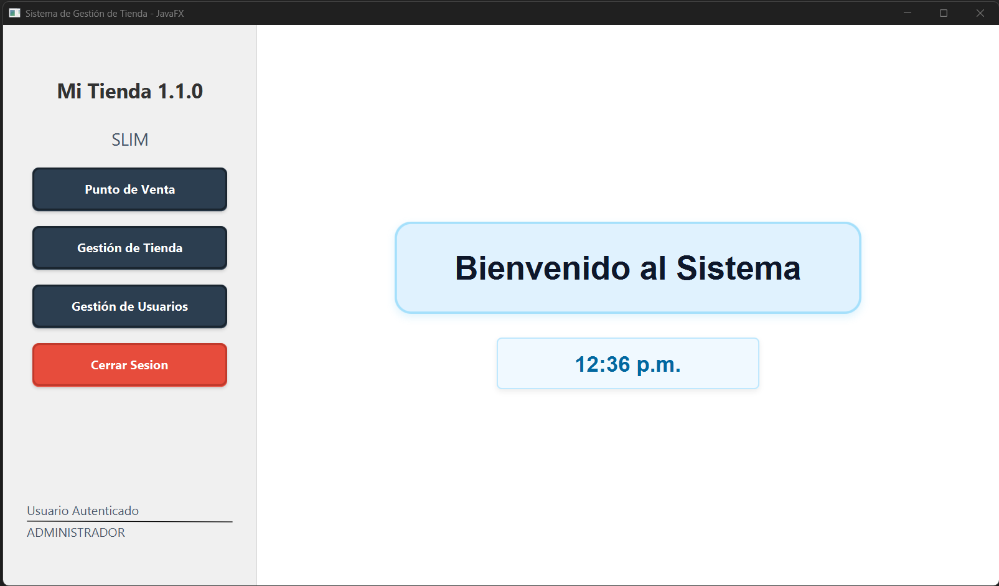
</p>

Entry point of the application. Provides centralized navigation to the main modules of the system, including store management and the point-of-sale module.

### 2. Store Management

<p>
    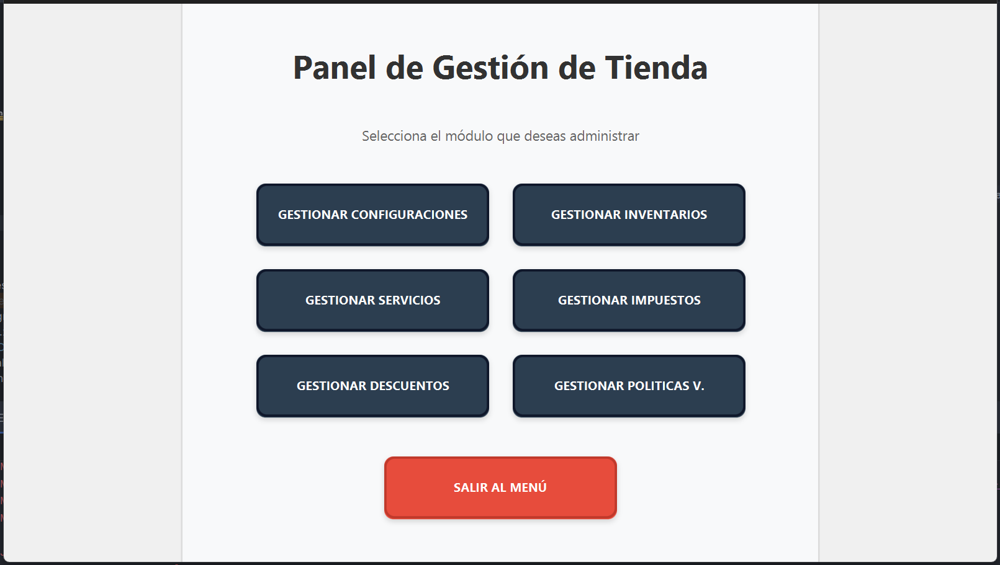
</p>

Central administration panel that provides access to the different management modules of the system. It allows independent management of configurations, inventories, services, taxes, discounts, and expiration policies from a single interface.

### 3. Inventory Management

<p>
    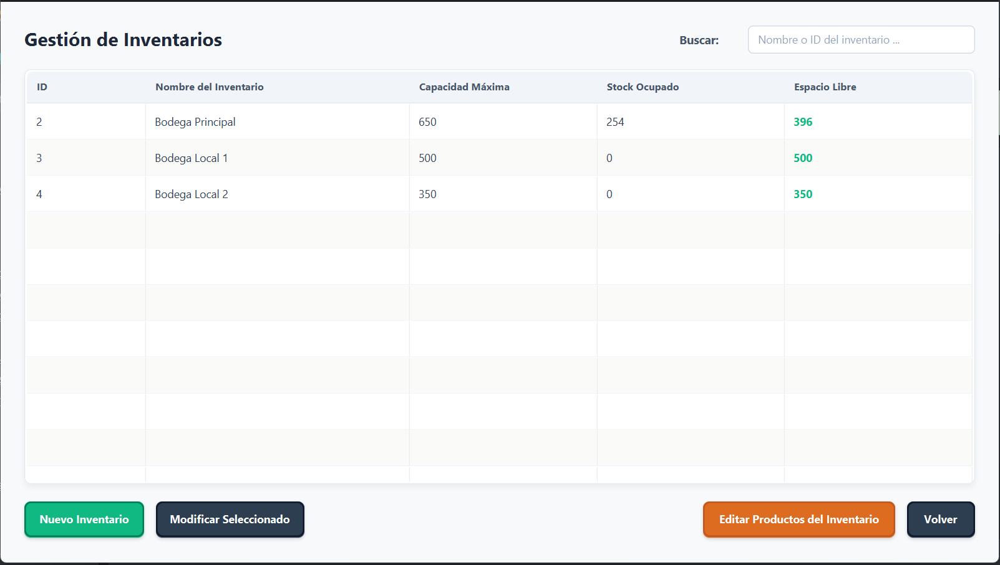
</p>

Allows the management of the store's inventories by displaying their maximum capacity, occupied stock, and available space. From this module, users can create new inventories, modify existing ones, and manage the products stored in each inventory.

### 4. Product Management

<p>
    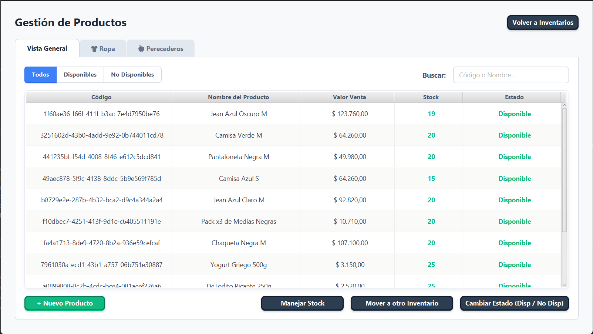
</p>

Allows the management of the products stored in an inventory through both a general view and specialized views for each product type. Includes search, availability filters, stock management, inventory transfers, and logical activation/deactivation without compromising historical data.

### 5. Service Management

<p>
    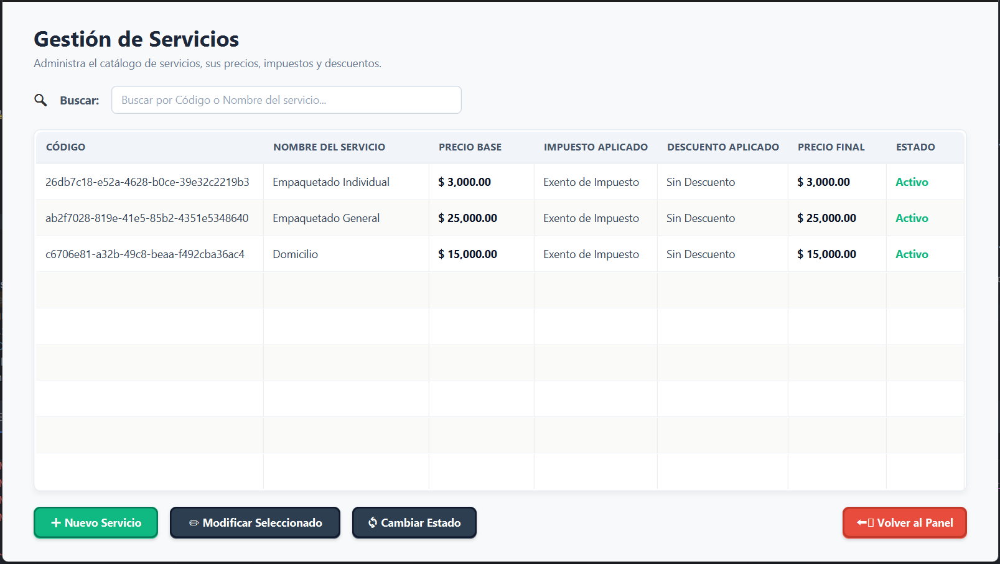
</p>

Allows the management of the store's service catalog, including base prices, taxes, discounts, and availability status. Unlike products, services are not stored in inventories or managed through stock, while still participating in the same billing process.

### 6. Commercial configurations

<p>
    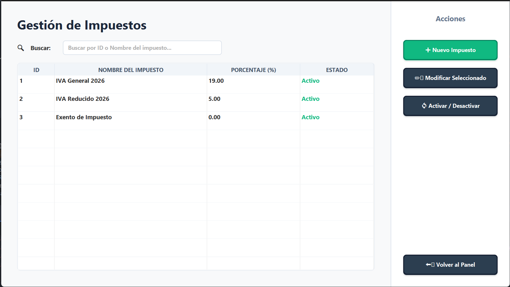
</p>

Module responsible for managing the business rules used throughout the system. It allows administrators to configure taxes, discounts, and expiration policies that are automatically applied during product and service management as well as the sales process, ensuring consistent calculations and business rules.

### 7. Configuration Management

<p>
    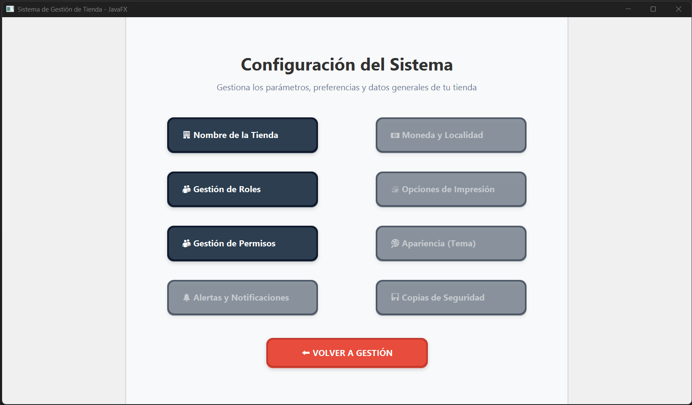
</p>

Central panel for managing general store and system settings. It allows you to manage the store name and access role and permission management, centralizing the configuration options available for application operation and access control.


### 8. POS Control Panel (Point of Sale)

<p>
    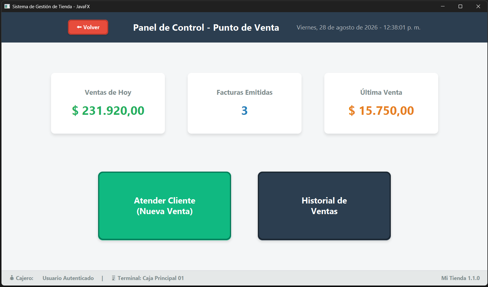
</p>

Main screen of the point of sale module. It displays a summary of the day's activity, including sales made, the number of invoices issued, and the value of the last sale. It also allows quick access to create a new sale and viewing the history of recorded sales.

### 9. Customer Service (New Sale)

<p>
    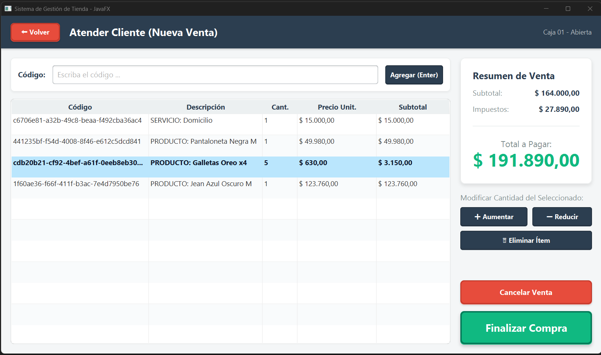
</p>

Main screen of the sales process. It allows you to add products using their code, manage the quantities of each item, remove products from the cart, and view the subtotal, taxes, and total amount due in real time. From this interface, you can also cancel the sale or finalize the purchase to generate the transaction.

### 10. Collection Report

<p>
    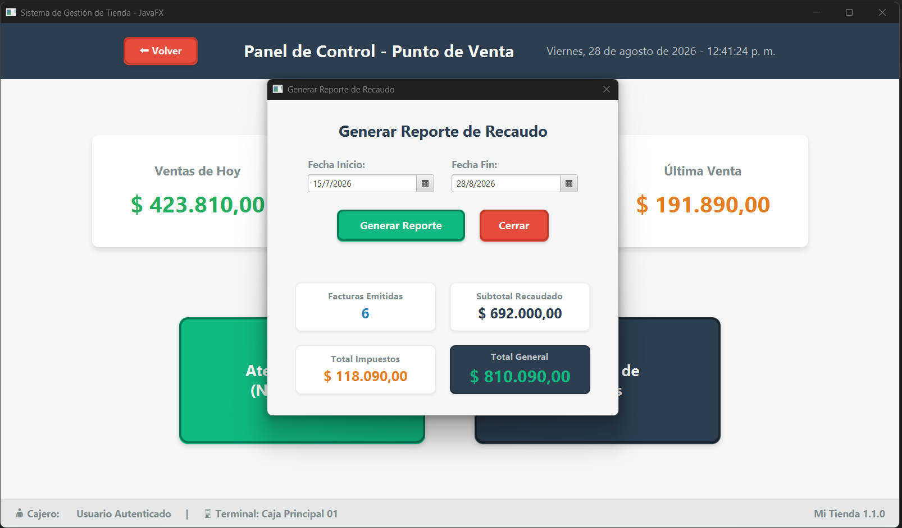
</p>

This collection report generation window is accessible from the Point of Sale module. It allows you to select a date range to calculate issued invoices, the subtotal collected, the taxes generated, and the total sales for the selected period.

### 11. Invoice

<p>
    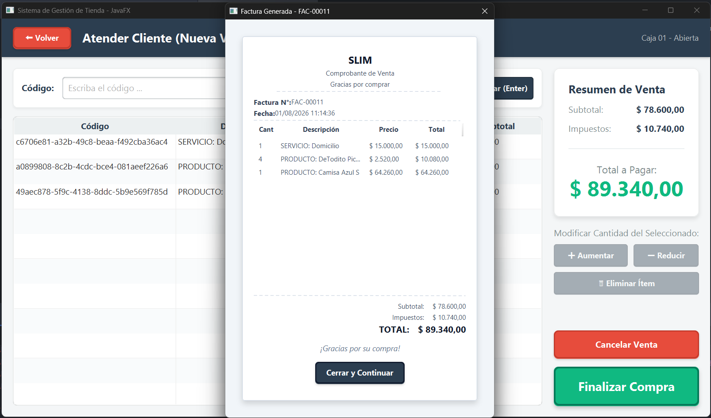
</p>

Upon completion of a sale, the system automatically generates a receipt detailing the products and services sold, quantities, prices, taxes, subtotal, and total of the transaction. This invoice summarizes the transaction and confirms the successful completion of the sale.

### 12. Login

<p>
    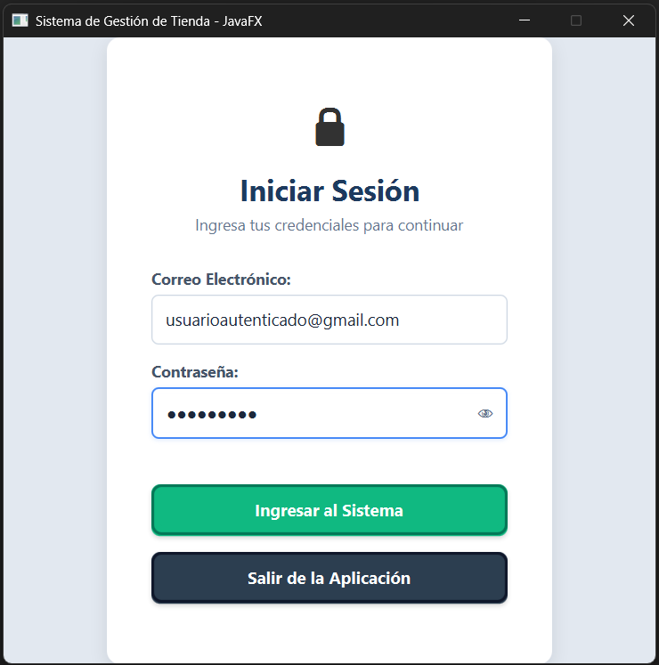
</p>

Application authentication screen. Allows users to log in using their email address and password, validating their credentials before granting access to the system. Includes options to display the password during login and logout.

### 13. Permission Management

<p>
    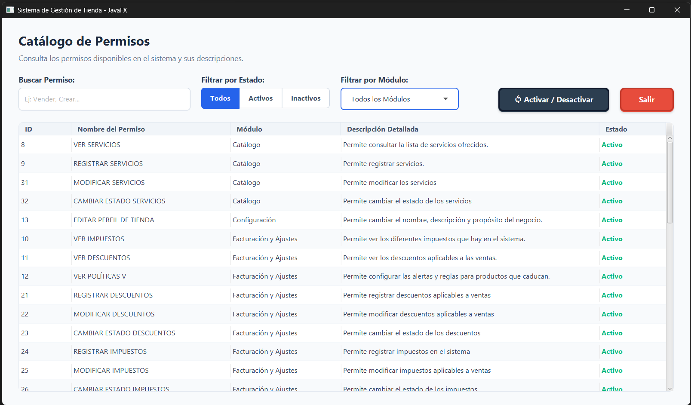
</p>

Allows you to view and manage the permissions available in the system. It includes search by name, filters by status and module, as well as the activation and deactivation of permissions. Each permission displays its associated module and a description of the action it authorizes, facilitating the administration and control of access to the application's functionalities.

### 14. Role Management

<p>
    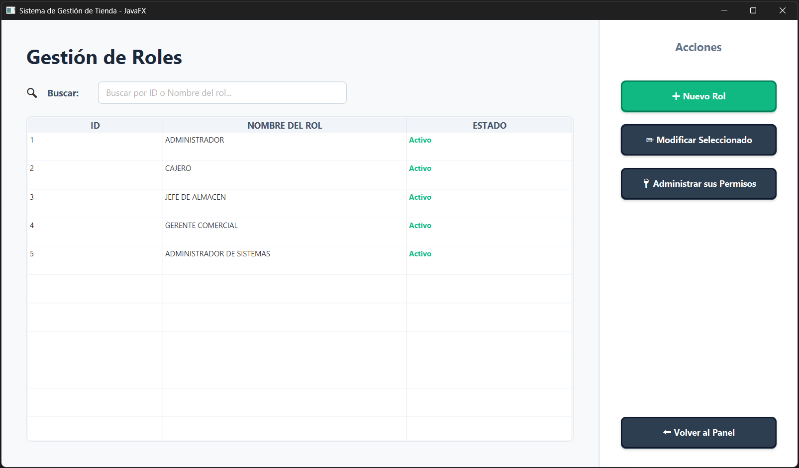
</p>

This allows you to manage system roles from a centralized view. It includes searching and viewing existing roles, creating new roles, modifying their information, and managing the permissions associated with each role. It also displays the availability status of roles, allowing you to control their participation in the system by activating or deactivating them.

### 15. User Management

<p>
    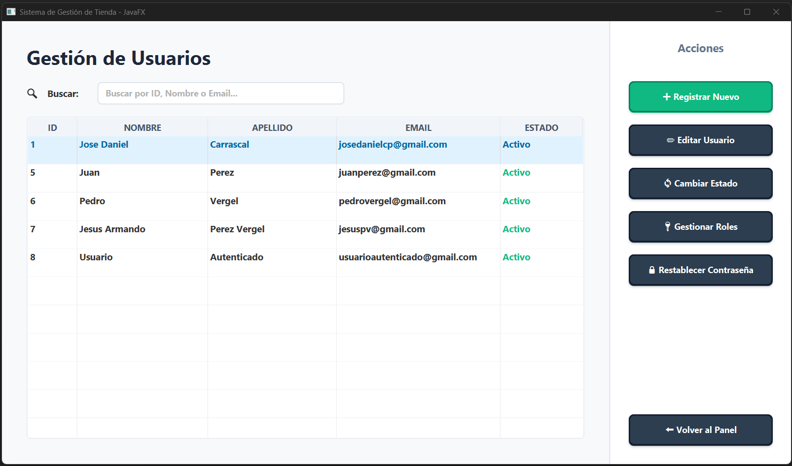
</p>

This allows you to manage users registered in the system from a centralized view. It includes searching by identifier, name, or email address, registering new users, editing information, activating and deactivating accounts, and managing assigned roles. It also allows users to reset their passwords using a temporary password.

---

## Design Decisions

### 1. Product Specialization

Products are not modeled as a generic entity. Each product type has its own attributes and business rules that can modify its behavior both during management and in the sales process. To maintain a flexible and scalable model, information common to all products is separated from the specific characteristics of each category. Currently, the system implements products such as Clothing and Perishables, and its design allows for the incorporation of new product types without modifying the existing structure, such as future technological products.

This decision avoids concentrating all characteristics and behaviors in a single generic entity, facilitating the scalability of the model and allowing the incorporation of new types of products without affecting existing ones.

### 2. Distinction between Products and Services

Products and services are modeled as independent entities due to differences in their behavior within the domain. While a product is part of inventory and is subject to stock control, a service does not require stock or inventory management. Despite these differences, both participate in the sales process as billable items, allowing the same invoice to include products and services through a unified billing flow. This separation keeps the domain model consistent without duplicating sales process logic.

This decision avoids treating services as a special type of product and allows each entity to implement only the business rules that correspond to it.

### 3. Use of BigDecimal

All operations involving monetary values and percentages were implemented using Java's BigDecimal class. This decision ensures accurate calculations in operations such as applying taxes and discounts, as well as obtaining subtotals, totals, and final prices, avoiding the precision errors associated with floating-point data types.

This decision guarantees the accuracy of monetary calculations and reflects a widely used practice in business applications where the accuracy of values is a fundamental requirement.

### 4. Layered Architecture

From the early stages of the project, a layered architecture was adopted to clearly separate the responsibilities of each system component. The user interface, business logic, and persistence are developed independently, allowing each layer to focus solely on its function. This facilitates code maintenance, improves readability, and allows for the incorporation of changes or new functionalities without unnecessarily affecting the rest of the application.

This decision reduces coupling between components and promotes a more maintainable, scalable, and easily evolving system.

### 5. Inter-Layer Communication

Communication between the user interface and the domain is handled through DTOs and assemblers, preventing the presentation layer from directly accessing business entities. Similarly, access to persistence is abstracted through interfaces and dependency injection, allowing the business logic to be decoupled from its implementation. This approach facilitates the replacement or evolution of individual components without affecting the operation of the rest of the system and maintains a clear separation between the different responsibilities of the application.

This decision avoids unnecessary dependencies between layers and promotes a more flexible, decoupled, and easy-to-maintain design.

### 6. Persistence Using Pure JDBC

The persistence layer was developed using pure JDBC instead of frameworks or ORMs. This decision was made to gain a deep understanding of how data access, connection management, SQL query execution, and the mapping between the domain model and the database work. The project implements its own persistence layer, keeping the data access logic completely separate from the domain and business logic.

This decision allowed for building a solid foundation in Java persistence fundamentals before incorporating higher-level tools like Spring Data or Hibernate.

### 7. Persistence Decoupling

The domain defines data access contracts through interfaces, while their concrete implementations reside in the infrastructure layer. In this way, the business logic depends solely on abstractions and not on specific persistence technologies. This organization allows for replacing the data access implementation without modifying the domain or the application services.

This decision reduces the coupling with persistence technology and facilitates system evolution and maintenance.

### 8. Multiple Inventories

The system allows the management of multiple inventories within the same store, treating each inventory as an independent unit for stock control. Products are managed through their corresponding inventory, maintaining a clear separation between product information and its storage location. This allows for the representation of different storage spaces while maintaining independence between them and precise control over the products recorded in each inventory.

This decision keeps the product model decoupled from inventory control and facilitates consistent stock management.

### 9. Historical Preservation Through Logical Deletion

Entities involved in business processes, such as products, services, taxes, discounts, and expiration policies, cannot be deleted from the application. Instead, the system allows their availability to be activated or deactivated, preventing them from falling into disuse without losing the associated historical information.

This decision ensures that historical records, such as invoices, retain all their original references even when some of these elements are no longer used in daily operations. This allows for accurate retrieval of past sales without compromising data integrity. The user interface allows for managing the status of these entities through activation and deactivation options, enabling them to be hidden from daily operations without deleting them from the database.

This decision preserves the integrity of the business history, prevents inconsistencies in historical records, and allows for the removal of operational elements without affecting previously recorded information.

### 10. Database Integrity

The database was designed prioritizing data integrity and consistency through a relational model that reflects the relationships between entities in the domain. Integrity constraints, foreign keys, and validation rules are used to ensure the consistency of the stored data.

The system avoids unnecessary data duplication through relationships between entities, ensuring that products, taxes, discounts, and expiration policies maintain consistent references within the data model. Furthermore, most required attributes are stored as non-null values, reducing the possibility of recording incomplete or inconsistent information.

This decision strengthens data reliability and allows business rules to be based on a consistent and secure data model.

### 11. Independent Configuration Catalogs

Taxes, discounts, and expiration policies are modeled as product-independent entities and managed through their own catalogs. Instead of storing these values ​​directly in each product, the system maintains references to the corresponding configurations. This approach allows for centralized modification or expansion of these elements, facilitating system adaptation to changes in business or regulatory conditions without altering the product model. It also promotes the reuse of common configurations across multiple products and avoids data duplication.

This decision centralizes the management of configurable business rules, improves data consistency, and facilitates system evolution in response to future changes.

### 12. Role- and Permission-Based Authorization

Users do not receive permissions directly. Instead, permissions are grouped within roles, and users can have multiple roles assigned. A user's effective permissions are determined by the roles they hold.

This approach allows for the reuse of permission sets among different users and avoids having to individually configure each permission for each account. It also allows for combining different roles to represent different levels of access without creating a specific role for each possible combination.

### 13. System-Defined Permissions

Available permissions cannot be created through the normal application workflow. Each permission represents a specific action that must already exist in the code, so adding new permissions requires modifying the system implementation. From within the application, the administrator can only manage existing permissions by assigning them to roles and enabling or disabling them.

This approach maintains a controlled correspondence between stored permissions and the actions that actually exist in the application, preventing the creation of arbitrary permissions without an associated operation.

### 14. Double Authorization Validation

Access to protected functionalities is controlled at two levels. The user interface visually limits the actions available to the user based on their permissions and restricts access to the corresponding screens. However, these restrictions are not considered a sufficient security measure. Before executing a protected operation, the corresponding orchestrator re-verifies that the current user has the required permission. If the authorization is invalid, a specific exception is thrown, and the operation is not executed.

This decision prevents security from relying on interface elements that can be compromised or bypassed and places validation at the layer that actually controls the execution of operations.

### 15. Password Management Using Temporary Credentials

Accounts are created exclusively by administrators, and a temporary password is generated during registration or reset. When a user logs in using a temporary password, the system detects this and prompts them to set a new password before allowing normal use of the application. Passwords are not stored directly in the database. Argon2 is used to generate their hash, and only this value is persisted.

This decision allows for centralized account creation and recovery without requiring the administrator to permanently set the user's personal password, while also avoiding storing the original credentials in the database.

### 16. Authentication Process Protection

The authentication process incorporates various mechanisms to reduce account attacks. After three incorrect password attempts, the user is temporarily locked out for a configurable period. Additionally, when the provided email address does not correspond to an existing user, the system also performs a hashing operation using a fake hash.

This decision aims to hinder both brute-force attacks and user enumeration by creating observable differences in the processing time of authentication requests.

---

## Technologies Used

| Technology | Use                                     |
|------------|-----------------------------------------|
| Java       | Business Logic                          |
| JavaFX     | Desktop Graphical Interface             |
| FXML       | Definition of Interface Views           |
| CSS        | Graphical Interface Styles              |
| JDBC       | Data Persistence                        |
| HikariCP   | JDBC Connection Pool                    |
| Argon2     | Password Encoder                        |
| MySQL      | Relational Database                     |
| Maven      | Dependency Management and Project Build |

---

## Installation and Execution

### Requirements

- Java 26 or higher
- Maven
- MySQL
- Git

### 1. Clone the repository

Download a local copy of the project by running:

```bash
git clone https://github.com/carrascalpjosedanieldev/retail-management-system.git 
cd retail-management-system
```

### 2. Configure the database

A copy of the project's database is included in the database/ folder.

Import the SQL file into MySQL. The script will automatically create the "mi_tienda" database if it doesn't already exist.

### 3. Configure the connection

Rename the file:

text
application.properties.example

to

text
application.properties

and configure the following information:

- Database URL (By default, it's the name of the database created by the script)
- Username
- Password

For your convenience, the instructions are also included in text application.properties.example

### 4. Run the project

Open the project with your preferred Maven-compatible IDE (IntelliJ IDEA), wait for Maven to download the dependencies, and run the application's main class.

---

## Architecture

### General Description

The system is organized using a layered architecture, where each component has a clearly defined responsibility. The graphical interface handles user interaction and communicates with the application through orchestrators. These act as the entry point to application operations, performing the necessary permissions, coordinating service usage, and transforming domain entities into DTOs to deliver only the required information to the presentation layer. Business logic is encapsulated within services, while data access is decoupled through ports and implementations specific to MySQL.

This organization allows for the separation of presentation, operational coordination, business logic, and persistence, facilitating code maintenance and enabling the modification or replacement of components in one layer without directly affecting others.

### Layered Architecture

Based on the separation of responsibilities and decoupling between presentation, use case coordination, business logic, and persistence. The graphical interface interacts with the application through orchestrators, services encapsulate business rules, and persistence is abstracted through ports and implementations specific to MySQL.

<p>
  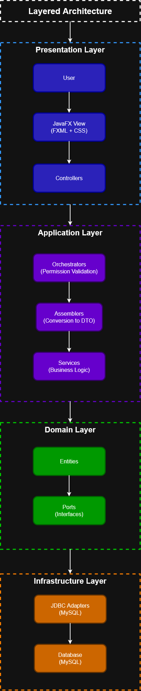
</p>

**Figure 1.** General system architecture organized by layers. Each layer depends only on the one immediately below it, promoting decoupling between the user interface, permission validations, business logic, and persistence infrastructure.

|                                                                                                              Request Flow                                                                                                              |                                                                                                                Response Flow                                                                                                                 |
|:--------------------------------------------------------------------------------------------------------------------------------------------------------------------------------------------------------------------------------------:|:--------------------------------------------------------------------------------------------------------------------------------------------------------------------------------------------------------------------------------------------:|
|                                                                                   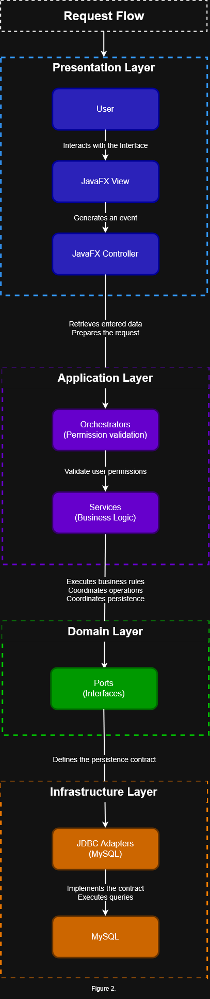                                                                                    |                                                                                      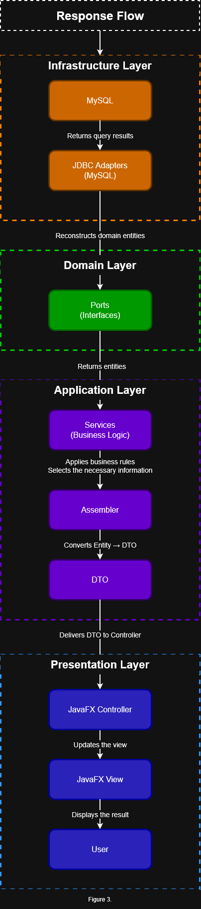                                                                                      |
| **Figure 2.** Request flow from user interaction to the execution of a database operation. Each layer performs only its corresponding responsibilities, maintaining decoupling between the interface, business logic, and persistence. | **Figure 3.** Response flow from persistence to the user interface. Before reaching the presentation layer, domain entities are transformed into DTOs using assemblers to prevent the interface from directly manipulating the domain model. |

### Package Structure

**Source Code**

```text
src/
main/
java/
RetailManagementSystem
│
├── application
│ ├── dto
│ ├── assemblers
│ ├── factories
│ ├── orchestrators
│ ├── ports
│ └── services
│
├── domain
│ ├── entities
│ ├── enums
│ ├── exceptions
│ └── ports
│
├── infrastructure
│ ├── configuration
│ ├── injection
│ ├── Persistence
│ │ ├── Exceptions
│ │ └── MySQL
│ └── Security
│
├── View
│ ├── Configuration
│ ├── Controllers
│ │ ├── ManageStore
│ │ ├── ManageUsers
│ │ ├── Login
│ │ ├── MainMenu
│ │ └── PointOfSale
│ ├── exceptions
│ └── utilities
│
├── App
└── Executable
```

**Resources**
```text
src/
main/
resources
│
├── css
│ ├── alerts
│ ├── manageStore
│ ├── manageUsers
│ ├── login
│ ├── mainMenu
│ └── pointOfSale
│
├── view
│ ├── manageStore
│ ├── manageUsers
│ ├── login
│ ├── mainMenu
│ └── pointOfSale
│
├── application.example.properties
└── application.properties
```

The project structure is organized following a layered architecture. Each package groups components with a specific responsibility, promoting separation of responsibilities and decoupling between the user interface, business logic, domain, and infrastructure.

| Package           | Responsibility                                                                                                                                      |
|-------------------|-----------------------------------------------------------------------------------------------------------------------------------------------------|
| `application`     | Contains the services, orchestrators, DTOs, assemblers, ports, and factories that coordinate the application's use cases.                           |
| `domain`          | Defines the domain's entities, ports, enumerations, and exceptions.                                                                                 |
| `infrastructure`  | Implements persistence using JDBC/MySQL, dependency injection, the classes responsible for security, and the application's technical configuration. |
| `view`            | Contains the JavaFX drivers and utilities related to the graphical interface.                                                                       |


---

## 🗺️ Roadmap

The following features are planned for future versions of the system:

- 🔐 Implement automated testing.

- 🌐 Add support for multiple languages (Spanish and English).

- 📄 Enable the export and printing of invoices and reports in PDF and Excel formats.

- 💻 Expand the system catalog with a new category of technology products.

- 📊 Incorporate indicators and statistics for the control panel.

- ⚙️ Complete the system configuration module with advanced customization options.

---

## Author

Jose Daniel Carrascal Pineda

Systems Engineering Student

2026

---

## License

This project is distributed under the MIT license.


---

---

---

# 🇪🇦 🇨🇴 Español

# Sistema de gestión para tiendas minoristas

## Descripción

Es una aplicación de escritorio diseñada para gestionar la operación de una tienda minorista y el proceso de venta de productos y servicios. Permite administrar configuraciones globales, productos, servicios, múltiples inventarios, impuestos, descuentos, usuarios, roles y permisos, además de gestionar el proceso de autenticación y control de acceso a las diferentes funcionalidades del sistema. Está orientada a la gestión de una única tienda y fue diseñada considerando los principales requisitos de negocio y normativos presentes en los procesos de venta.

El proyecto busca ofrecer un sistema de gestión y punto de venta centralizado con un fuerte énfasis en el modelado del dominio, las reglas de negocio y el control de acceso. El dominio de una tienda fue elegido por la diversidad de escenarios que permite representar, como la gestión de inventarios, el cálculo de impuestos y descuentos, el manejo de distintos tipos de productos, la generación de facturas y la administración de diferentes niveles de acceso mediante roles y permisos. Se prioriza un diseño que refleje el comportamiento real del negocio y mantenga separadas las responsabilidades de sus diferentes componentes.

Este proyecto comenzó como una aplicación de consola con el objetivo de aprender programación orientada a objetos y evolucionó gradualmente hasta convertirse en una aplicación de escritorio completa. A lo largo de su desarrollo se incorporaron persistencia mediante JDBC y MySQL, una arquitectura por capas, servicios y orquestadores, así como una interfaz gráfica con JavaFX. También se implementó un sistema de autenticación y autorización que permite administrar usuarios, roles y permisos, incluyendo mecanismos para gestionar contraseñas y restringir el acceso a las operaciones según los permisos del usuario. Todo el proyecto fue desarrollado sin utilizar frameworks con el propósito de comprender en profundidad los fundamentos de Java, el diseño de software, la persistencia y la arquitectura antes de trabajar con tecnologías como Spring Boot.

---

## 🚧 Estado del proyecto

**Versión actual:** 1.1.0

| Módulo               | Estado           |
|----------------------|------------------|
| Gestión de la tienda | ✅ Finalizado     |
| Punto de venta       | ✅ Finalizado     |
| Gestion de usuarios  | ✅ Finalizado     |
| Login                | ✅ Finalizado     |
| Documentación        | 🚧 En desarrollo |
| Versión 1.1.0        | ✅ Finalizado     |

### Proximo Objetivo

Implement **Automated Testing**.

---

## Características

### 🏪 Gestión de la Tienda
- Configuración global de la tienda.
- Administración de información general del negocio.

### 📦 Gestión de Productos
- Registro, consulta, actualización y eliminación de productos.
- Soporte para múltiples tipos de productos con comportamientos específicos.
- Asociación de características propias según el tipo de producto.
- Control del estado de disponibilidad de los productos.

### 🛠️ Gestión de Servicios
- Administración independiente de servicios.
- Tratamiento de productos y servicios como ítems facturables dentro del proceso de venta.
- Control del estado de disponibilidad de los servicios.

### 📚 Gestión de Inventarios
- Administración de múltiples inventarios.
- Asociación de cualquier tipo de producto a un inventario.
- Control del stock por inventario.

### 💰 Gestión Comercial
- Administración de impuestos y descuentos.
- Gestión de precios utilizando BigDecimal para garantizar precisión en cálculos monetarios.
- Configuración de políticas de vencimiento.
- Activación e inactivación de configuraciones comerciales.

### 🧾 Facturación
- Generación de facturas.
- Registro del detalle completo de la venta.
- Aplicación automática de impuestos y descuentos.
- Cálculo preciso de subtotales y totales.

### 🖥️ Punto de Venta
- Proceso de venta desde una interfaz gráfica.
- Selección de productos y servicios.
- Generación automática de la factura.
- Aplicación de las reglas comerciales configuradas.
- Actualización del inventario como parte del proceso de venta.

### 👤 Gestión de Usuarios
- Registro de nuevos usuarios por parte de administradores.
- Administración y edición de usuarios existentes.
- Activación e inactivación de usuarios.
- Asignación y eliminación de roles.
- Asignación de múltiples roles a un mismo usuario.
- Restablecimiento de contraseñas mediante contraseñas temporales.

### 🔐 Autenticación
- Inicio de sesión mediante correo electrónico y contraseña.
- Detección del primer acceso mediante contraseña temporal.
- Solicitud de cambio de contraseña al utilizar una contraseña temporal.
- Bloqueo temporal de cuentas después de múltiples intentos fallidos.
- Configuración del tiempo de bloqueo de las cuentas.

### 👥 Gestión de Roles
- Creación de nuevos roles.
- Edición de roles existentes.
- Activación e inactivación de roles.
- Asignación y eliminación de permisos de un rol.

### 🛡️ Gestión de Permisos
- Administración de permisos existentes.
- Activación e inactivación de permisos.
- Control de acceso a las funcionalidades según los permisos asignados.
- Los permisos disponibles corresponden a acciones definidas por el sistema.

---

## Screenshots

### 1. Menu Principal

<p>
  
</p>

Punto de entrada de la aplicación. Centraliza la navegación hacia los diferentes módulos del sistema y proporciona acceso a las funcionalidades principales de gestión y ventas.

### 2. Gestion de la Tienda

<p>
  
</p>

Panel central de administración desde el que se accede a los diferentes módulos de gestión del sistema. Permite administrar configuraciones, inventarios, servicios, impuestos, descuentos y políticas de vencimiento desde una única interfaz.

### 3. Gestion de Inventarios

<p>
  
</p>

Permite administrar los inventarios de la tienda, consultar su capacidad máxima, el stock ocupado y el espacio disponible. Desde este módulo es posible crear nuevos inventarios, modificar su información y acceder a la gestión de los productos almacenados en cada uno.

### 4. Gestion de Productos

<p>
  
</p>

Permite administrar los productos de un inventario mediante una vista general y vistas especializadas por tipo de producto. Incluye búsqueda, filtros por disponibilidad, control de stock, transferencia entre inventarios y cambio de estado sin eliminar el historial de la información.

### 5. Gestion de Servicios

<p>
  
</p>

Permite administrar el catálogo de servicios ofrecidos por la tienda. Incluye la configuración de precios, impuestos, descuentos y estado de disponibilidad, manteniendo un proceso de facturación consistente con el de los productos.

### 6. Configuraciones comerciales

<p>
  
</p>

Módulo encargado de administrar las reglas comerciales utilizadas por el sistema. Permite gestionar impuestos, descuentos y políticas de vencimiento que se aplican automáticamente durante la administración de productos, servicios y el proceso de venta, garantizando la consistencia de los cálculos y las reglas de negocio.

### 7. Gestion Configuraciones

<p>
  
</p>

Panel central para administrar las configuraciones generales de la tienda y del sistema. Permite gestionar el nombre de la tienda y acceder a la administración de roles y permisos, centralizando las opciones de configuración disponibles para la operación y el control de acceso de la aplicación.

### 8. Panel de control POS (Punto de Venta)

<p>
  
</p>

Pantalla principal del módulo de punto de venta. Presenta un resumen de la actividad del día, incluyendo las ventas realizadas, el número de facturas emitidas y el valor de la última venta. Además, permite acceder rápidamente a la creación de una nueva venta y consultar el historial de ventas registradas.

### 9. Atención al Cliente (Nueva Venta)

<p>
  
</p>

Pantalla principal del proceso de venta. Permite agregar productos mediante su código, administrar las cantidades de cada artículo, eliminar productos del carrito y visualizar en tiempo real el subtotal, los impuestos y el total a pagar. Desde esta interfaz también es posible cancelar la venta o finalizar la compra para generar la transacción.

### 10. Reporte de Recaudo

<p>
  
</p>

Ventana de generación de reportes de recaudo accesible desde el módulo Punto de Venta. Permite seleccionar un rango de fechas para calcular las facturas emitidas, el subtotal recaudado, los impuestos generados y el total de ventas correspondiente al período seleccionado.

### 11. Factura

<p>
  
</p>

Al finalizar una venta, el sistema genera automáticamente un comprobante con el detalle de los productos y servicios vendidos, cantidades, precios, impuestos, subtotal y total de la transacción. Esta factura resume la operación realizada y permite confirmar el cierre exitoso de la venta.

### 12. Login

<p>
  
</p>

Pantalla de autenticación de la aplicación. Permite a los usuarios ingresar mediante su correo electrónico y contraseña, validando sus credenciales antes de proporcionar acceso al sistema. Incluye opciones para visualizar la contraseña durante su ingreso y salir de la aplicación.

### 13.Gestion de Permisos

<p>
  
</p>

Permite consultar y administrar los permisos disponibles en el sistema. Incluye búsqueda por nombre, filtros por estado y módulo, así como la activación e inactivación de permisos. Cada permiso muestra su módulo asociado y una descripción de la acción que autoriza, facilitando la administración y el control de acceso a las funcionalidades de la aplicación.

### 14. Gestion de Roles

<p>
  
</p>

Permite administrar los roles del sistema desde una vista centralizada. Incluye la búsqueda y consulta de los roles existentes, la creación de nuevos roles, la modificación de su información y la administración de los permisos asociados a cada uno. También muestra el estado de disponibilidad de los roles, permitiendo controlar su participación en el sistema mediante su activación o inactivación.

### 15. Gestion de Usuarios

<p>
  
</p>

Permite administrar los usuarios registrados en el sistema desde una vista centralizada. Incluye búsqueda por identificador, nombre o correo electrónico, registro de nuevos usuarios, edición de información, activación e inactivación de cuentas y gestión de los roles asignados. También permite restablecer la contraseña de un usuario mediante una contraseña temporal.

---

## Decisiones de Diseño

Las siguientes decisiones de diseño reflejan los principios que guiaron el desarrollo del proyecto. En cada caso se buscó construir un modelo de dominio coherente con el funcionamiento de una tienda minorista, priorizando la claridad del diseño, la mantenibilidad del código y la integridad de la información antes que la rapidez de implementación.

### 1. Especialización de Productos

Los productos no se modelan como una entidad genérica. Cada tipo de producto posee atributos y reglas de negocio propias que pueden modificar su comportamiento tanto durante la gestión como en el proceso de venta. Para mantener un modelo flexible y escalable, la información común de todos los productos se separa de las características específicas de cada categoría. Actualmente el sistema implementa productos como Ropa y Perecederos, y su diseño permite incorporar nuevos tipos de productos sin modificar la estructura existente, como futuros productos tecnológicos.

Esta decisión evita concentrar todas las características y comportamientos en una única entidad genérica, facilitando la escalabilidad del modelo y permitiendo incorporar nuevos tipos de productos sin afectar los ya existentes.

### 2. Separación entre Productos y Servicios

Los productos y los servicios se modelan como entidades independientes debido a las diferencias en su comportamiento dentro del dominio. Mientras que un producto forma parte de un inventario y está sujeto al control de stock, un servicio no requiere existencias ni gestión de inventario. A pesar de estas diferencias, ambos participan en el proceso de venta como ítems facturables, permitiendo que una misma factura incluya productos y servicios mediante un flujo de facturación unificado. Esta separación mantiene el modelo de dominio coherente sin duplicar la lógica del proceso de venta.

Esta decision evita tratar los servicios como un tipo especial de producto y permite que cada entidad implemente únicamente las reglas de negocio que le corresponden.

### 3. Uso de BigDecimal

Todas las operaciones relacionadas con valores monetarios y porcentajes se implementaron utilizando la clase BigDecimal de Java. Esta decisión garantiza cálculos precisos en operaciones como la aplicación de impuestos y descuentos, así como en la obtención de subtotales, totales y precios finales, evitando los errores de precisión asociados a los tipos de dato de punto flotante.

Esta decisión garantiza la precisión de los cálculos monetarios y refleja una práctica ampliamente utilizada en aplicaciones empresariales donde la exactitud de los valores es un requisito fundamental.

### 4. Arquitectura por capas

Desde las primeras etapas del proyecto se adoptó una arquitectura por capas con el objetivo de separar claramente las responsabilidades de cada componente del sistema. La interfaz de usuario, la lógica de negocio y la persistencia se desarrollan de forma independiente, permitiendo que cada capa se centre únicamente en su función. Facilitando el mantenimiento del código, mejorando su legibilidad y permitiendo incorporar cambios o nuevas funcionalidades sin afectar innecesariamente al resto de la aplicación.

Esta decisión reduce el acoplamiento entre los componentes y favorece un sistema más mantenible, escalable y fácil de evolucionar.

### 5. Comunicación entre capas

La comunicación entre la interfaz de usuario y el dominio se realiza mediante DTO y ensambladores, evitando que la capa de presentación acceda directamente a las entidades del negocio. De igual forma, el acceso a la persistencia se abstrae mediante interfaces e inyección de dependencias, permitiendo desacoplar la lógica de negocio de su implementación. Este enfoque facilita la sustitución o evolución de componentes individuales sin afectar el funcionamiento del resto del sistema y mantiene una clara separación entre las distintas responsabilidades de la aplicación.

Esta decisión evita dependencias innecesarias entre las capas y favorece un diseño más flexible, desacoplado y fácil de mantener.

### 6. Persistencia mediante JDBC puro

La capa de persistencia fue desarrollada utilizando JDBC puro en lugar de frameworks u ORM. Esta decisión fue tomada con el objetivo de comprender en profundidad el funcionamiento del acceso a datos, la gestión de conexiones, la ejecución de consultas SQL y el mapeo entre el modelo de dominio y la base de datos. El proyecto implementa una capa de persistencia propia, manteniendo la lógica de acceso a datos completamente separada del dominio y de la lógica de negocio.

Esta decisión permitió construir una base sólida sobre los fundamentos de la persistencia en Java antes de incorporar herramientas de mayor nivel como Spring Data o Hibernate.

### 7. Desacoplamiento de la persistencia

El dominio define los contratos de acceso a datos mediante interfaces, mientras que sus implementaciones concretas se encuentran en la capa de infraestructura. De esta manera, la lógica de negocio depende únicamente de abstracciones y no de tecnologías específicas de persistencia. Esta organización permite reemplazar la implementación de acceso a datos sin modificar el dominio ni los servicios de la aplicación.

Esta decisión reduce el acoplamiento con la tecnología de persistencia y facilita la evolución y el mantenimiento del sistema.

### 8. Multiples Inventarios

El sistema permite administrar múltiples inventarios dentro de una misma tienda, considerando cada inventario como una unidad independiente para el control del stock. Los productos son gestionados a través de su inventario correspondiente, manteniendo una clara separación entre la información del producto y el lugar donde se almacena. Lo que permite representar distintos espacios de almacenamiento manteniendo la independencia entre ellos y un control preciso sobre los productos registrados en cada inventario.

Esta decisión mantiene desacoplado el modelo de productos del control de inventarios y facilita una gestión consistente del stock.

### 9. Conservación del historial mediante borrado lógico

Las entidades que participan en procesos de negocio, como productos, servicios, impuestos, descuentos y políticas de vencimiento, no pueden eliminarse desde la aplicación. En su lugar, el sistema permite activar o desactivar su disponibilidad, evitando que dejen de utilizarse sin perder la información histórica asociada. 

Esta decisión garantiza que registros históricos, como las facturas, conserven todas sus referencias originales incluso cuando alguno de estos elementos deja de utilizarse en la operación diaria. De esta forma, es posible consultar correctamente ventas realizadas en el pasado sin comprometer la integridad de la información. Desde la interfaz de usuario es posible administrar el estado de estas entidades mediante opciones de activación e inactivación, permitiendo ocultarlas de la operación cotidiana sin eliminarlas de la base de datos.

Esta decisión preserva la integridad del historial del negocio, evita inconsistencias en los registros históricos y permite retirar elementos de operación sin afectar la información previamente registrada.

### 10. Integridad de la base de datos

La base de datos fue diseñada priorizando la integridad y consistencia de la información mediante un modelo relacional que refleja las relaciones existentes entre las entidades del dominio. Para ello se emplean restricciones de integridad, claves foráneas y reglas de validación que garantizan la coherencia de los datos almacenados.

El sistema evita la duplicación innecesaria de información mediante relaciones entre entidades, de forma que productos, impuestos, descuentos y políticas de vencimiento mantienen referencias consistentes dentro del modelo de datos. Asimismo, la mayoría de los atributos obligatorios se almacenan como valores no nulos, reduciendo la posibilidad de registrar información incompleta o inconsistente.

Esta decisión fortalece la confiabilidad de la información y permite que las reglas de negocio se apoyen sobre un modelo de datos consistente y segura.

### 11. Catálogos independientes de configuración

Los impuestos, descuentos y políticas de vencimiento se modelan como entidades independientes del producto y se administran mediante sus propios catálogos. En lugar de almacenar estos valores directamente en cada producto, el sistema mantiene referencias a las configuraciones correspondientes. Este enfoque permite modificar o ampliar estos elementos de forma centralizada, facilitando la adaptación del sistema ante cambios en las condiciones comerciales o normativas sin alterar el modelo de los productos. Además, promueve la reutilización de configuraciones comunes entre múltiples productos y evita la duplicación de información.

Esta decisión centraliza la administración de las reglas configurables del negocio, mejora la consistencia de la información y facilita la evolución del sistema ante cambios futuros.

### 12. Autorización basada en roles y permisos

Los usuarios no reciben permisos directamente. En su lugar, los permisos se agrupan dentro de roles y los usuarios pueden tener múltiples roles asignados. Los permisos efectivos de un usuario se determinan a partir de los roles que tiene asociados.

Esta decisión permite reutilizar conjuntos de permisos entre diferentes usuarios y evita tener que configurar individualmente cada permiso para cada cuenta. Además, permite combinar diferentes roles para representar distintos niveles de acceso sin crear un rol específico para cada combinación posible.

### 13. Permisos definidos por el sistema

Los permisos disponibles no pueden crearse mediante el flujo normal de la aplicación. Cada permiso representa una acción concreta que debe existir previamente en el código, por lo que la incorporación de nuevos permisos requiere una modificación de la implementación del sistema. Desde la aplicación, el administrador únicamente puede administrar los permisos existentes mediante su asignación a roles y su activación o inactivación.

Esta decisión mantiene una correspondencia controlada entre los permisos almacenados y las acciones que realmente existen en la aplicación, evitando que se puedan crear permisos arbitrarios que no tengan una operación asociada.

### 14. Doble validación de autorización

El acceso a las funcionalidades protegidas se controla en dos niveles. La interfaz de usuario limita visualmente las acciones disponibles para el usuario según sus permisos y restringe el acceso a las pantallas correspondientes. Sin embargo, estas restricciones no se consideran una medida de seguridad suficiente. Antes de ejecutar una operación protegida, el orquestador correspondiente vuelve a verificar que el usuario actual posea el permiso requerido. Si la autorización no es válida, se lanza una excepción específica y la operación no se ejecuta.

Esta decisión evita que la seguridad dependa de elementos de la interfaz que pueden ser vulnerados o evadidos y establece la validación en la capa que realmente controla la ejecución de las operaciones.

### 15. Gestión de contraseñas mediante credenciales temporales

Las cuentas son creadas exclusivamente por administradores y, durante su registro o restablecimiento, se genera una contraseña temporal. Cuando el usuario inicia sesión utilizando una contraseña temporal, el sistema detecta esta condición y solicita establecer una nueva contraseña antes de permitir el uso normal de la aplicación. Las contraseñas no se almacenan directamente en la base de datos. Se utiliza Argon2 para generar su hash y únicamente este valor es persistido.

Esta decisión permite centralizar la creación y recuperación de cuentas sin que el administrador tenga que establecer permanentemente la contraseña personal del usuario, al mismo tiempo que evita almacenar las credenciales originales en la base de datos.

### 16. Protección del proceso de autenticación

El proceso de autenticación incorpora diferentes mecanismos para reducir ataques sobre las cuentas. Después de tres intentos incorrectos de contraseña, el usuario queda bloqueado temporalmente durante un período configurable. Además, cuando el correo electrónico proporcionado no corresponde a un usuario existente, el sistema realiza igualmente una operación de hashing utilizando un hash falso.

Esta decisión busca dificultar tanto los ataques de fuerza bruta como la enumeración de usuarios mediante diferencias observables en el tiempo de procesamiento de las solicitudes de autenticación.

---

## Tecnologías utilizadas

| Tecnología | Uso                                                 |
|------------|-----------------------------------------------------|
| Java       | Lógica de negocio                                   |
| JavaFX     | Interfaz gráfica de escritorio                      |
| FXML       | Definición de las vistas de la interfaz             |
| CSS        | Estilos de la interfaz gráfica                      |
| JDBC       | Persistencia de datos                               |
| HikariCP   | Pool de conexiones JDBC                             |
| Argon2     | Codificador de contraseñas                          |
| MySQL      | Base de datos relacional                            |
| Maven      | Gestión de dependencias y construcción del proyecto |

---

## Instalación y Ejecución

### Requisitos

- Java 26 o superior
- Maven
- MySQL
- Git

### 1. Clonar el repositorio

Descarga una copia local del proyecto ejecutando:

```bash
git clone https://github.com/carrascalpjosedanieldev/retail-management-system.git
cd retail-management-system
```

### 2. Configurar la base de datos

En la carpeta database/ se incluye una copia de la base de datos del proyecto.

Importa el archivo SQL en MySQL. El script crea automáticamente la base de datos "mi_tienda" si no existe.

### 3. Configurar la conexión

Renombra el archivo:

text
application.properties.example

por

text
application.properties

y configura los siguientes datos:

- URL de la base de datos (Por defecto está con el nombre de la base de datos que el script crea)
- Usuario
- Contraseña

Para más comodidad las instrucciones también están en text application.properties.example

### 4. Ejecutar el proyecto

Abre el proyecto con tu IDE preferido compatible con Maven (IntelliJ IDEA), espera a que Maven descargue las dependencias y ejecuta la clase principal de la aplicación.

---

## Arquitectura

### Descripción General

El sistema está organizado siguiendo una arquitectura por capas, donde cada componente posee una responsabilidad claramente definida. La interfaz gráfica se encarga de la interacción con el usuario y se comunica con la aplicación mediante orquestadores. Estos actúan como punto de entrada a las operaciones de la aplicación, realizando las validaciones de permisos correspondientes, coordinando el uso de los servicios y transformando las entidades del dominio en DTO's para entregar a la capa de presentación únicamente la información necesaria. La lógica de las operaciones de negocio se encuentra encapsulada en servicios, mientras que el acceso a los datos se encuentra desacoplado mediante puertos e implementaciones específicas para MySQL.

Esta organización permite separar la presentación, la coordinación de las operaciones, la lógica de negocio y la persistencia, favoreciendo el mantenimiento del código y permitiendo modificar o reemplazar componentes de una capa sin afectar directamente a las demás.

### Arquitectura por capas

Basada en la separación de responsabilidades y el desacoplamiento entre la presentación, la coordinación de los casos de uso, la lógica de negocio y la persistencia. La interfaz gráfica interactúa con la aplicación mediante orquestadores, los servicios encapsulan las reglas de negocio y la persistencia se abstrae mediante puertos e implementaciones específicas para MySQL.

<p>
  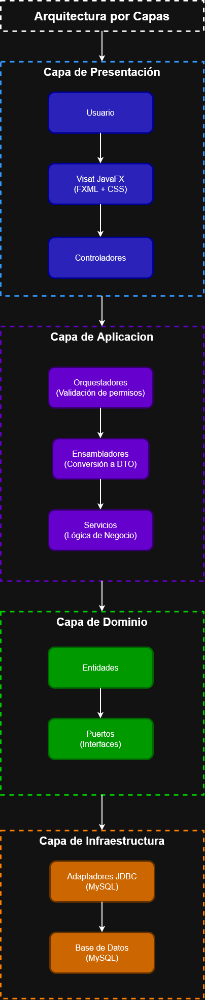
</p>

**Figura 1.** Arquitectura general del sistema organizada por capas. Cada capa depende únicamente de la inmediatamente inferior, favoreciendo el desacoplamiento entre la interfaz de usuario, las validaciones de permisos, la lógica de negocio y la infraestructura de persistencia.

|                                                                                                                                      Flujo de una petición                                                                                                                                      |                                                                                                                                Flujo de una respuesta                                                                                                                                 |
|:-----------------------------------------------------------------------------------------------------------------------------------------------------------------------------------------------------------------------------------------------------------------------------------------------:|:-------------------------------------------------------------------------------------------------------------------------------------------------------------------------------------------------------------------------------------------------------------------------------------:|
|                                                                                                              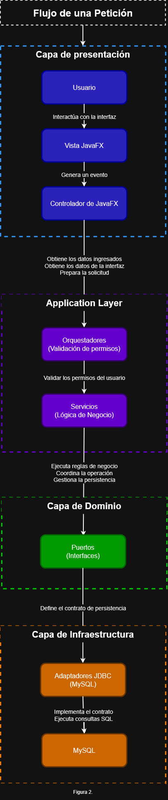                                                                                                              |                                                                                                        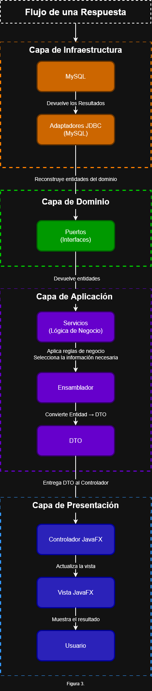                                                                                                         |
| **Figura 2.** Flujo de una petición desde la interacción del usuario hasta la ejecución de una operación en la base de datos. Cada capa realiza únicamente las responsabilidades que le corresponden, manteniendo el desacoplamiento entre la interfaz, la lógica de negocio y la persistencia. | **Figura 3.** Flujo de una respuesta desde la persistencia hasta la interfaz de usuario. Antes de llegar a la capa de presentación, las entidades del dominio son transformadas en DTO mediante ensambladores para evitar que la interfaz manipule directamente el modelo de dominio. |

### Estructura de paquetes

**Código Fuente**
```text
src/
main/
java/
RetailManagementSystem
│
├── aplicacion 
│   ├── dto
│   ├── ensambladores
│   ├── fabricas
│   ├── orquestadores
│   ├── puertos
│   └── servicios
│
├── dominio
│   ├── entidades
│   ├── enums
│   ├── excepciones
│   └── puertos
│
├── infraestructura
│   ├── configuracion
│   ├── inyeccion
│   ├── persistencia
│   │   ├── excepciones
│   │   └── mysql
│   └── seguridad
│
├── vista
│   ├── configuracion
│   ├── controladores
│   │   ├── gestionarTienda
│   │   ├── gestionarUsuarios
│   │   ├── login
│   │   ├── menuPrincipal
│   │   └── puntoDeVenta
│   ├── excepciones
│   └── utilidades
│
├── App
└── Ejecutable
```

**Recursos**
```text
src/
main/
resources
│
├── css
│   ├── alertas
│   ├── gestionarTienda
│   ├── gestionarUsuarios
│   ├── login
│   ├── menuPrincipal
│   └── puntoDeVenta
│
├── vista
│   ├── gestionarTienda
│   ├── gestionarUsuarios
│   ├── login
│   ├── menuPrincipal
│   └── puntoDeVenta
│
├── application.example.properties
└── application.properties

```

La estructura del proyecto está organizada siguiendo una arquitectura por capas. Cada paquete agrupa componentes con una responsabilidad específica, favoreciendo la separación de responsabilidades y el desacoplamiento entre la interfaz de usuario, la lógica de negocio, el dominio y la infraestructura.

| Paquete              | Responsabilidad                                                                                                                                                  |
|----------------------|------------------------------------------------------------------------------------------------------------------------------------------------------------------|
| `aplicacion`         | Contiene los servicios, orquestadores, DTO, ensambladores, puertos y fábricas que coordinan los casos de uso de la aplicación.                                   |
| `dominio`            | Define las entidades, puertos, enumeraciones y excepciones del dominio.                                                                                          |
| `infraestructura`    | Implementa la persistencia mediante JDBC/MySQL, la inyeccion de dependencias, las clases encargadas de la seguridad y la configuración técnica de la aplicación. |
| `vista`              | Contiene los controladores JavaFX y las utilidades relacionadas con la interfaz gráfica.                                                                         |

---

## 🗺️ Roadmap

Las siguientes funcionalidades están planificadas para futuras versiones del sistema:

- 🔐 Implementar testing automatizado.
- 🌐 Agregar soporte para múltiples idiomas (Español e Inglés).
- 📄 Permitir la exportación e impresión de facturas y reportes en formatos PDF y Excel.
- 💻 Ampliar el catálogo del sistema con una nueva categoría de productos tecnológicos.
- 📊 Incorporar indicadores y estadísticas para el panel de control.
- ⚙️ Completar el módulo de configuración del sistema con opciones avanzadas de personalización.

---

## Autor

Jose Daniel Carrascal Pineda

Estudiante de Ing. de Sistemas

2026

---

## Licencia

Este proyecto se distribuye bajo la licencia MIT.

